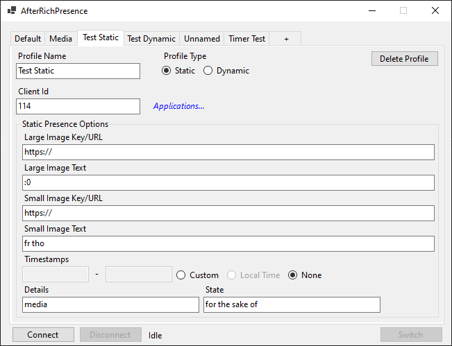
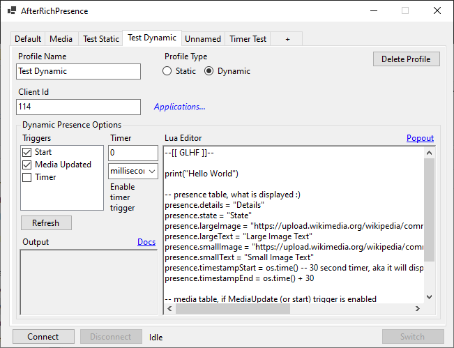

# AfterRichPresence
A Windows programmable discord rich presence

# Features
- Scriptable (with lua)
- Profiles

# TODO
- Run at startup (w/ automatic profile)
- Auto reconnect (if NotRunning exception)
- Cleanup codebase (it's just the starter base, aight?)

# Notes
- Windows only (because of a few features, to lazy to release different versions)

# Images

